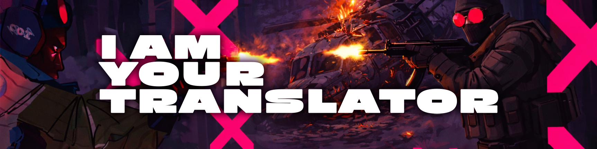

# 🌍 IAmYourTranslator

## 📝 Description

Mod for I Am Your Beast that allows localizing the interface, adds audio and font replacement, making the game accessible in your native language.

## ✨ Features

- 🌐 **UI Text Translation** - Localization of all (or almost all) UI elements
- 🎵 **Audio Replacement** - Dubbing of cutscenes and radio conversations in the game
- 🎯 **Font Replacement from .ttf/.otf files** - No more "squares" in text when applying translation

## 🚀 Installation

1. 📥 Download and install BepInEx 5+ for your game (follow the official BepInEx documentation)
2. 📂 Copy the `IAmYourTranslator.dll` file to the `BepInEx/plugins` folder in the game directory
3. 🎮 Launch the game - the mod activates automatically!

## 📋 Requirements

| Component      | Version          | Description              |
| -------------- | ---------------- | ------------------------ |
| BepInEx        | 5.0+             | Framework for Unity mods |
| I Am Your Beast| Build 17931007+  | Main-Game                |

## 🆘 Support

If you encounter issues:

- 📋 Create an issue on the [GitHub repository](https://github.com/lenarikil/IAmYourTranslator)
- 📧 Specify the game version, BepInEx version, and detailed error description
- 📁 Attach logs from `BepInEx/LogOutput.log`

## 📄 License

This project is distributed under the **MIT License**. Free use, modification, and distribution with copyright preservation.
